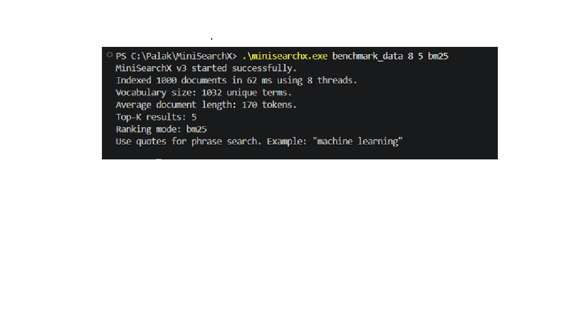

# MiniSearchX


MiniSearchX is a multithreaded C++ search engine that indexes local text documents and returns ranked search results using an inverted index, TF-IDF scoring, and BM25 ranking.

This project demonstrates core software engineering concepts including data structures, algorithms, file processing, multithreading, synchronization, query processing, ranking, unit testing, continuous integration, and performance benchmarking.

## Features

* Indexes `.txt` files from a local folder
* Tokenizes and normalizes text
* Builds an inverted index using hash maps
* Supports multi-word search queries
* Supports phrase search using quoted queries
* Supports TF-IDF and BM25 ranking modes
* Supports configurable top-K result count
* Returns top search results using a priority queue
* Supports multithreaded document indexing
* Uses Windows synchronization primitives to protect shared index updates
* Measures indexing time and query latency
* Includes 17 unit tests for core search engine functionality
* Includes GitHub Actions CI for automated C++ test execution
* Includes benchmark results for single-threaded and multithreaded indexing

## Tech Stack

* C++
* STL
* Hash Maps
* Priority Queue
* File I/O
* TF-IDF Ranking
* BM25 Ranking
* Windows Threads
* Critical Sections for Synchronization
* PowerShell for test and benchmark scripts
* GitHub Actions for CI

## Project Structure

```text
MiniSearchX/
│
├── .github/
│   └── workflows/
│       └── cpp-tests.yml
│
├── src/
│   └── main.cpp
│
├── data/
│   ├── doc1.txt
│   ├── doc2.txt
│   └── doc3.txt
│
├── tests/
│   └── test_minisearchx.cpp
│
├── scripts/
│   ├── generate_benchmark_data.ps1
│   └── run_tests.ps1
│
├── screenshots/
│   └── benchmark.png
│
├── README.md
└── .gitignore
```

## How It Works

MiniSearchX reads all `.txt` files from a folder, tokenizes the content, and builds an inverted index.

```text
term -> document ID -> frequency
```

Example:

```text
systems -> doc1, doc3
learning -> doc2
threads -> doc3
```

When a user enters a search query, MiniSearchX calculates document scores using either TF-IDF or BM25 and returns the highest-ranked results.

## Inverted Index

The inverted index stores each term with the documents in which it appears.

Instead of scanning every document for every query, the search engine directly checks the index to find matching documents.

This improves search efficiency and demonstrates the use of hash maps for fast lookup.

## TF-IDF Ranking

MiniSearchX supports TF-IDF scoring.

TF-IDF gives higher importance to terms that appear frequently in a specific document but are less common across the entire document collection.

This allows the search engine to return more relevant results instead of only checking whether a word exists in a document.

## BM25 Ranking

MiniSearchX also supports BM25 ranking.

BM25 improves upon basic TF-IDF by considering term frequency saturation and document length normalization. This makes it more suitable for ranked information retrieval systems where longer documents should not automatically dominate shorter ones.

The ranking mode can be selected from the command line:

```powershell
.\minisearchx.exe benchmark_data 8 5 bm25
```

## Phrase Search

MiniSearchX supports phrase search using quoted queries.

Example:

```text
"machine learning"
```

For phrase search, the engine checks whether the query tokens appear consecutively in a document.

## Top-K Retrieval

MiniSearchX supports configurable top-K results.

Example:

```powershell
.\minisearchx.exe data 4 3 tfidf
```

This command runs the engine with:

* `data` as the input folder
* `4` worker threads
* `3` top results
* `tfidf` as the ranking mode

## Multithreading Design

MiniSearchX divides the document list into chunks and assigns each chunk to a separate worker thread.

Each thread:

1. Reads assigned documents
2. Tokenizes text
3. Builds a local term-frequency map
4. Updates the shared inverted index inside a synchronized critical section

Only the shared index update is locked. File reading and tokenization happen outside the lock to improve parallelism.

## Synchronization

The shared inverted index is protected using Windows Critical Sections.

This prevents multiple threads from writing to the shared data structure at the same time, avoiding race conditions and maintaining correctness during parallel indexing.

## Benchmark Results

Benchmark dataset: 1,000 generated text documents
Vocabulary size: 1,032 unique terms

| Threads   | Indexing Time |
| --------- | ------------: |
| 1 thread  |        278 ms |
| 4 threads |         97 ms |
| 8 threads |         65 ms |

Using 8 threads reduced indexing time from 278 ms to 65 ms, achieving approximately 76.6% faster indexing compared to the single-threaded run.



## Reproducing the Benchmark

Generate the benchmark dataset:

```powershell
.\scripts\generate_benchmark_data.ps1
```

If PowerShell blocks script execution, run:

```powershell
powershell -ExecutionPolicy Bypass -File .\scripts\generate_benchmark_data.ps1
```

Compile the project:

```powershell
g++ -std=c++11 src/main.cpp -o minisearchx
```

Run with 1 thread:

```powershell
.\minisearchx.exe benchmark_data 1
```

Run with 4 threads:

```powershell
.\minisearchx.exe benchmark_data 4
```

Run with 8 threads:

```powershell
.\minisearchx.exe benchmark_data 8
```

Run with BM25 ranking:

```powershell
.\minisearchx.exe benchmark_data 8 5 bm25
```

## How to Compile

```powershell
g++ -std=c++11 src/main.cpp -o minisearchx
```

## How to Run

Run on the sample data folder with TF-IDF ranking:

```powershell
.\minisearchx.exe data 4 3 tfidf
```

Run on the benchmark data folder with BM25 ranking:

```powershell
.\minisearchx.exe benchmark_data 8 5 bm25
```

Command format:

```powershell
.\minisearchx.exe <folder_path> <thread_count> <top_k> <ranking_mode>
```

Supported ranking modes:

```text
tfidf
bm25
```

## Example Queries

```text
google systems
machine learning
threads synchronization
"machine learning"
distributed systems
search engine
```

To exit the search prompt:

```text
exit
```

## Sample Output

```text
MiniSearchX v3 started successfully.
Indexed 1000 documents in 68 ms using 8 threads.
Vocabulary size: 1032 unique terms.
Average document length: 170 tokens.
Top-K results: 5
Ranking mode: bm25
Use quotes for phrase search. Example: "machine learning"

search> "machine learning"
Top results:
1. benchmark_data\doc999.txt | score: 0.00192164
2. benchmark_data\doc998.txt | score: 0.00192164
3. benchmark_data\doc997.txt | score: 0.00192164
4. benchmark_data\doc996.txt | score: 0.00192164
5. benchmark_data\doc995.txt | score: 0.00192164
Query latency: 8763 microseconds.
```

## Unit Tests

MiniSearchX includes 17 unit tests for the core search engine functionality.

The tests cover:

* Tokenization and text normalization
* Phrase-query detection
* Quote trimming
* Document indexing
* Vocabulary generation
* Worker-thread usage
* TF-IDF search
* BM25 search
* Phrase search
* Top-K result limiting

Run tests using:

```powershell
powershell -ExecutionPolicy Bypass -File .\scripts\run_tests.ps1
```

You can also compile and run tests manually:

```powershell
g++ -std=c++11 tests/test_minisearchx.cpp -o test_minisearchx
.\test_minisearchx.exe
```

Sample test result:

```text
Running MiniSearchX unit tests...
[PASS] Tokenizer returns correct number of tokens
[PASS] Tokenizer converts text to lowercase
[PASS] Tokenizer removes punctuation
[PASS] Tokenizer keeps numeric tokens
[PASS] Detects quoted phrase query
[PASS] Detects normal non-phrase query
[PASS] Removes quotes from phrase query
[PASS] Indexes all test documents
[PASS] Builds non-empty vocabulary
[PASS] Uses requested worker threads when possible
[PASS] TF-IDF search returns results
[PASS] TF-IDF ranks most relevant document first
[PASS] Phrase search returns results
[PASS] Phrase search finds exact phrase document
[PASS] BM25 search returns results
[PASS] Top-K limit is respected
[PASS] BM25 ranks relevant document first

Tests passed: 17
Tests failed: 0
```

## Continuous Integration

MiniSearchX includes a GitHub Actions CI workflow that automatically builds and runs the C++ unit tests on push and pull request events.

The CI workflow:

1. Checks out the repository
2. Sets up a Windows-based C++ build environment
3. Compiles `tests/test_minisearchx.cpp`
4. Runs the generated test executable
5. Fails the workflow if any unit test fails

Workflow file:

```text
.github/workflows/cpp-tests.yml
```

Latest verified local test result:

```text
Tests passed: 17
Tests failed: 0
```

## Key Concepts Demonstrated

* Inverted indexing
* TF-IDF ranking
* BM25 ranking
* Phrase search
* Top-K retrieval
* Hash maps
* Priority queues
* File processing
* Query processing
* Multithreaded indexing
* Synchronization using critical sections
* Unit testing
* GitHub Actions CI
* Benchmarking and performance comparison


## Future Improvements

* Add AND/OR query support
* Add cross-platform filesystem support
* Refactor into modular header and source files
* Add larger and more realistic benchmark datasets
* Add stemming and stopword removal
* Add snippet generation for search results
